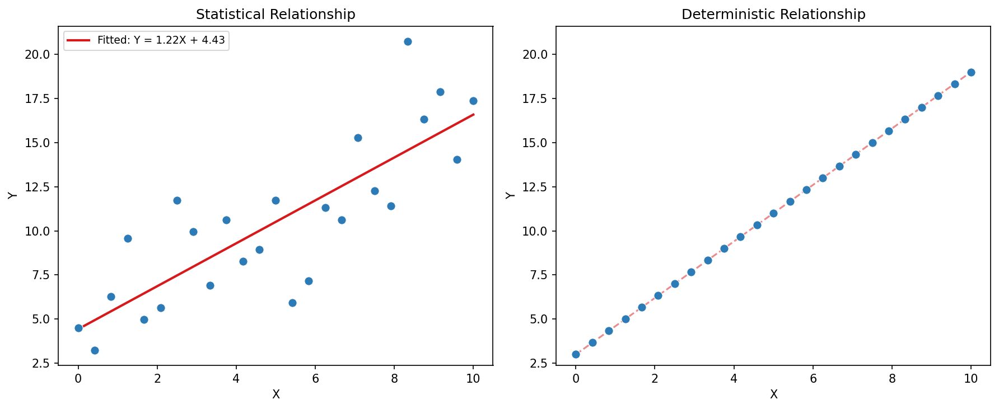
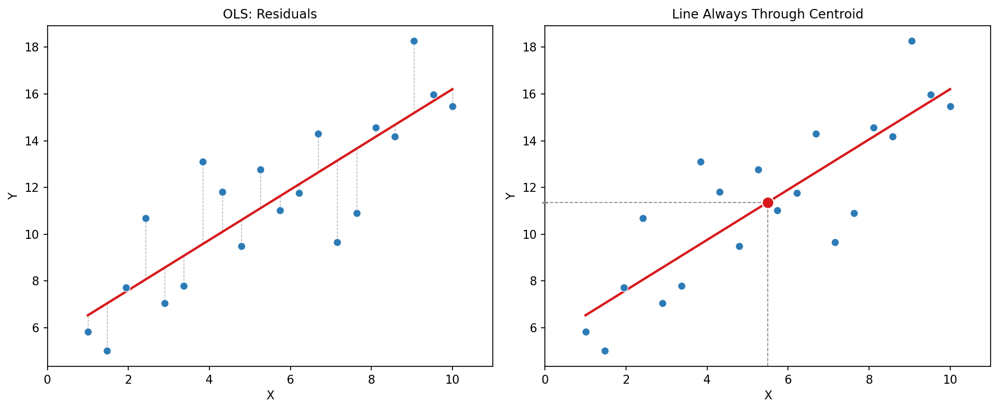
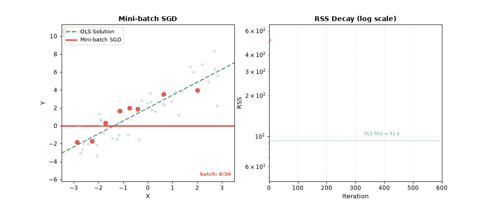
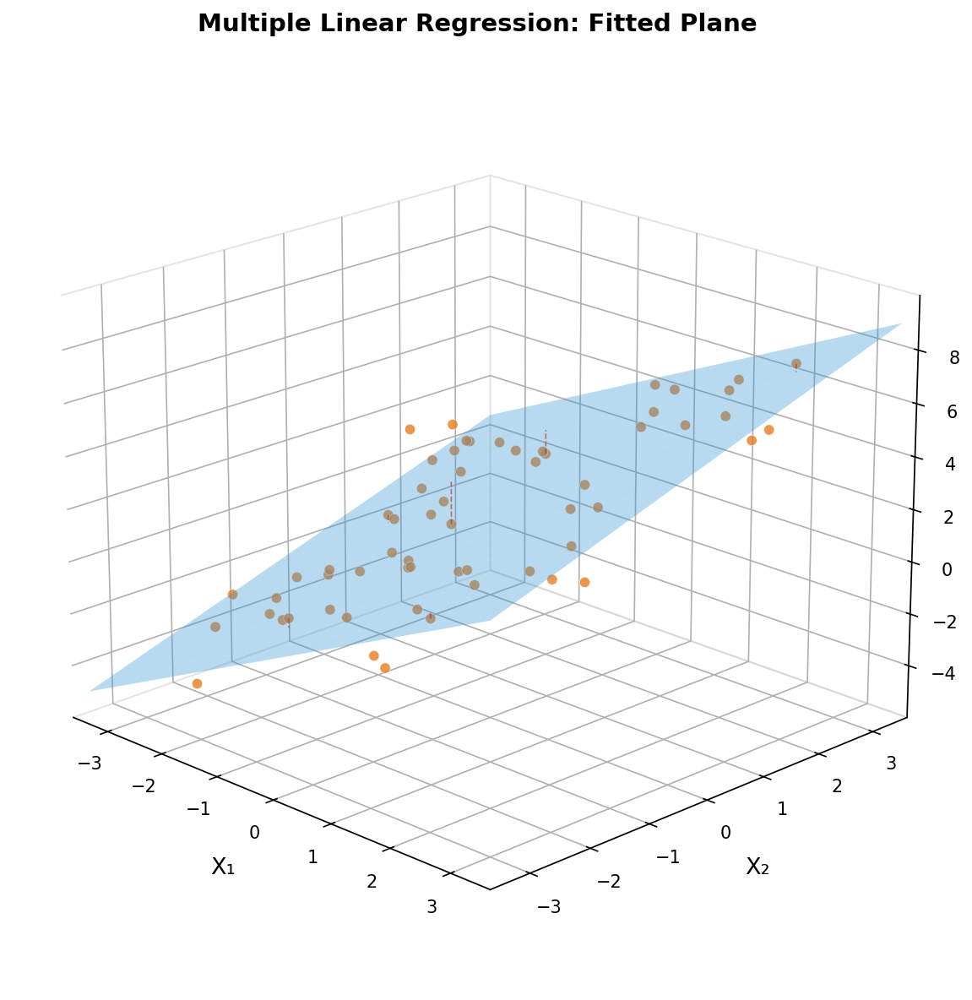

---
title: "Linear Model"
collection: learning
permalink: /learning/2026-09-07-linear-model
excerpt: 'Understanding the classical linear model from a statistical perspective'
date: 2026-09-07
tags: [linear-model, statistics, least-squares, regression, 机器学习]
---

## 1. The Linear Model: Idea and Motivation

### 1.1 Deterministic vs Statistical Relationships

Relationships between variables fall into two categories. A **deterministic relationship** is one where the response can be expressed as an exact mathematical function of the predictors — no randomness involved. For example, given a circle's radius $r$, its area $A = \pi r^2$ is perfectly determined: knowing $r$ gives $A$ without error.

A **statistical relationship**, by contrast, is one where the response is not perfectly predictable. Observed values scatter around an underlying trend, and the deviations are captured by a random error term:

$$
Y = f(X) + \varepsilon
$$

$f(X)$ is the systematic component (e.g. $\beta_0 + \beta_1 X$), and $\varepsilon$ is the random component. Measurement error, omitted variables, and inherent variability all contribute to this randomness.

This distinction is fundamental because it shifts the goal from exact calculation to **inference** — estimating parameters, quantifying uncertainty, and making probabilistic statements.

### 1.2 Identifying Statistical Relationships: The Scatterplot

The most direct tool for detecting a statistical relationship is the **scatterplot**.

Three telltale signs:

- **A visible trend** — as $X$ increases, $Y$ tends to increase or decrease systematically, suggesting $f(X)$
- **Spread around the trend** — points deviate from any single curve; the signature of $\varepsilon$
- **No perfect fit** — no smooth function passes through all points exactly

Once a statistical relationship is visually confirmed, the next step is to model it — and the linear model is the natural starting point.

### 1.3 The Simple Linear Regression Model

Formalizing the above, the **simple linear regression model** assumes:

$$
Y_i = \beta_0 + \beta_1 X_i + \varepsilon_i, \quad i = 1, \dots, n
$$

Component meanings:

- $\beta_0$ (**intercept**): the expected value of $Y$ when $X = 0$; anchors the line vertically
- $\beta_1$ (**slope**): the expected change in $Y$ for a one-unit increase in $X$; captures the strength and direction of the linear association
- $\varepsilon_i$ (**random error**): everything affecting $Y_i$ beyond the linear function of $X_i$ — measurement error, omitted variables, inherent variability

$\beta_0 + \beta_1 X_i$ is the **systematic component** (the explained part); $\varepsilon_i$ is the **stochastic component** (the unexplained part). The statistical problem: given $n$ pairs of observations $(X_i, Y_i)$, estimate $\beta_0$ and $\beta_1$.

## 2. Ordinary Least Squares Estimation

### 2.1 The OLS Principle and Scalar Derivation

**Ordinary least squares** (OLS) chooses the line that minimizes the sum of squared vertical distances:

$$
\hat{\beta}_0, \hat{\beta}_1 = \arg\min_{\beta_0, \beta_1} \sum_{i=1}^n \bigl(Y_i - \beta_0 - \beta_1 X_i\bigr)^2
$$

Define the residual $e_i = Y_i - \hat{\beta}_0 - \hat{\beta}_1 X_i$. OLS minimizes $\sum e_i^2$.

Why squares rather than absolute values? Three reasons: (1) squares are differentiable everywhere, yielding clean closed-form solutions; (2) squaring penalizes large deviations more heavily; (3) under the Gauss-Markov assumptions (Section 3), OLS delivers optimal statistical properties.

Let $Q(\beta_0, \beta_1) = \sum_{i=1}^n (Y_i - \beta_0 - \beta_1 X_i)^2$. Differentiating:

**With respect to $\beta_0$:**

$$
\frac{\partial Q}{\partial \beta_0} = -2 \sum_{i=1}^n (Y_i - \beta_0 - \beta_1 X_i) = 0
\;\Longrightarrow\;
\hat{\beta}_0 = \bar{Y} - \hat{\beta}_1 \bar{X} \tag{1}
$$

The fitted line **always passes through the centroid** $(\bar{X}, \bar{Y})$.

**With respect to $\beta_1$:**

$$
\frac{\partial Q}{\partial \beta_1} = -2 \sum_{i=1}^n X_i (Y_i - \beta_0 - \beta_1 X_i) = 0
$$

Substituting (1) and rearranging, with $S_{XX} = \sum (X_i - \bar{X})^2$ and $S_{XY} = \sum (X_i - \bar{X})(Y_i - \bar{Y})$:

$$
\boxed{\hat{\beta}_1 = \frac{S_{XY}}{S_{XX}} = \frac{\sum (X_i - \bar{X})(Y_i - \bar{Y})}{\sum (X_i - \bar{X})^2}} \tag{2}
$$

(1) and (2) are the **OLS estimators** — functions of data alone, no unknown parameters.

Equivalently, in terms of the sample correlation $r_{XY}$:

$$
\hat{\beta}_1 = r_{XY} \cdot \frac{s_Y}{s_X}
$$

The estimated slope is the correlation scaled by the ratio of variabilities.

### 2.2 Matrix Form and the Normal Equations

The scalar derivation is elegant but doesn't scale. Rewriting in matrix-vector form:

$$
\mathbf{y} = \mathbf{X}\boldsymbol{\beta} + \boldsymbol{\varepsilon}
$$

where $\mathbf{y} \in \mathbb{R}^n$, the design matrix $\mathbf{X} \in \mathbb{R}^{n \times (p+1)}$ has a leading column of 1s for the intercept, and $\boldsymbol{\beta} \in \mathbb{R}^{p+1}$. The residual sum of squares becomes the squared $\ell_2$-norm:

$$
\text{RSS}(\boldsymbol{\beta}) = \|\mathbf{y} - \mathbf{X}\boldsymbol{\beta}\|_2^2 = (\mathbf{y} - \mathbf{X}\boldsymbol{\beta})^\top (\mathbf{y} - \mathbf{X}\boldsymbol{\beta})
$$

Differentiating and setting to zero:

$$
\frac{\partial\,\text{RSS}}{\partial\boldsymbol{\beta}} = -2\mathbf{X}^\top(\mathbf{y} - \mathbf{X}\boldsymbol{\beta}) = \mathbf{0}
\;\Longrightarrow\;
\boxed{\mathbf{X}^\top\!\mathbf{X}\,\hat{\boldsymbol{\beta}} = \mathbf{X}^\top\mathbf{y}}
$$

These are the **normal equations**. When $\mathbf{X}^\top\!\mathbf{X}$ is invertible (columns of $\mathbf{X}$ are linearly independent — no perfect multicollinearity), the closed-form solution is:

$$
\boxed{\hat{\boldsymbol{\beta}} = (\mathbf{X}^\top\!\mathbf{X})^{-1}\mathbf{X}^\top\mathbf{y}} \tag{3}
$$

For simple regression ($p=1$), expanding (3) reproduces the scalar estimators exactly. But the real power of this form is generality: it holds for any number of predictors, serving as the unified algebraic framework behind multiple regression, polynomial regression, and basis expansions.

### 2.3 Gradient Descent: An Iterative Alternative

The closed form requires inverting $\mathbf{X}^\top\!\mathbf{X}$ at a cost of $O(p^3)$. When $p$ is large — millions of features in genomics or text modelling — this is prohibitive. **Gradient descent** offers an alternative.

Starting from an initial guess $\boldsymbol{\beta}^{(0)}$ (often zeros), repeatedly step downhill:

$$
\boldsymbol{\beta}^{(t+1)} = \boldsymbol{\beta}^{(t)} - \alpha \nabla \text{RSS}(\boldsymbol{\beta}^{(t)})
$$

where the learning rate $\alpha > 0$ controls step size, and $\nabla \text{RSS} = -2\mathbf{X}^\top(\mathbf{y} - \mathbf{X}\boldsymbol{\beta})$.

Two practical variants:

- **Batch Gradient Descent**: computes the gradient over all $n$ observations. Converges smoothly but is expensive per iteration for large $n$
- **Stochastic Gradient Descent (SGD)**: uses a single observation (or a small mini-batch) per step, trading gradient accuracy for speed. This noisy-but-cheap update is the foundation of modern deep-learning optimisation

The choice between closed-form and gradient descent:

| | Closed-Form $(\mathbf{X}^\top\!\mathbf{X})^{-1}\mathbf{X}^\top\mathbf{y}$ | Gradient Descent |
|---|---|---|
| **Cost** | $O(np^2 + p^3)$, one-time | $O(np)$ per iteration |
| **Large $p$** | Intractable | Works |
| **Large $n$** | Fine | Use SGD |
| **Exact** | Yes | Approximate |
| **Requires invertibility** | Yes (or regularise) | No |
| **Extensible** | Limited | Naturally extends to Lasso, Ridge, neural nets |

In classical statistics with modest $p$, the closed form is preferred — exact and directly tied to inference. In machine learning with large $p$, or when the linear model sits inside a larger optimisation pipeline, gradient descent is the default. Both arrive at the same $\hat{\boldsymbol{\beta}}$; only the path differs.

## 3. Statistical Properties of OLS

### 3.1 Gauss-Markov: Assumptions and BLUE

The OLS formulas in Section 2 are purely algebraic — they minimize $\sum e_i^2$ without any probabilistic model. To understand *why* OLS is a good estimator, we specify a data-generating process. The **Gauss-Markov assumptions**:

1. **Linearity**: $Y_i = \beta_0 + \beta_1 X_i + \varepsilon_i$
2. **Strict exogeneity**: $\mathbb{E}[\varepsilon_i \mid X] = 0$
3. **Homoskedasticity**: $\operatorname{Var}(\varepsilon_i \mid X) = \sigma^2$ for all $i$
4. **No autocorrelation**: $\operatorname{Cov}(\varepsilon_i, \varepsilon_j \mid X) = 0$ for $i \neq j$
5. **No perfect collinearity**: the $X_i$ are not all identical ($S_{XX} > 0$)

Note that **normality is not required** — only the first two moments matter.

Under these assumptions, $\hat{\beta}_0$ and $\hat{\beta}_1$ are the **Best Linear Unbiased Estimators** (BLUE):

- **Linear**: $\hat{\beta}_1 = \sum c_i Y_i$ with $c_i = (X_i - \bar{X})/S_{XX}$. The theorem only compares OLS to estimators of this linear-in-$Y$ form
- **Unbiased**: $\mathbb{E}[\hat{\beta}_1] = \beta_1$. Direct proof: $\mathbb{E}[\hat{\beta}_1] = \sum c_i \mathbb{E}[Y_i] = \sum c_i(\beta_0 + \beta_1 X_i) = \beta_1$, using $\sum c_i = 0$ and $\sum c_i X_i = 1$
- **Best** (minimum variance): for any other linear unbiased estimator $\tilde{\beta}_1$, $\operatorname{Var}(\hat{\beta}_1) \leq \operatorname{Var}(\tilde{\beta}_1)$. The OLS variance is

  $$
  \operatorname{Var}(\hat{\beta}_1) = \frac{\sigma^2}{S_{XX}}
  $$

  which decreases as $X$ spreads wider or $\sigma^2$ shrinks — both under the researcher's control through study design.

The theorem gives OLS firm theoretical footing with minimal assumptions. But it has boundaries: biased estimators like ridge regression can beat OLS on mean squared error when predictors are highly correlated.

### 3.2 Maximum Likelihood Perspective

If we strengthen the assumptions with **normality**:

$$
\varepsilon_i \mid X \stackrel{\text{i.i.d.}}{\sim} N(0, \sigma^2)
$$

then $Y_i \mid X_i \sim N(\beta_0 + \beta_1 X_i, \sigma^2)$, and the log-likelihood is:

$$
\ell(\beta_0, \beta_1, \sigma^2) = -\frac{n}{2}\ln(2\pi) - \frac{n}{2}\ln(\sigma^2) - \frac{1}{2\sigma^2}\sum_{i=1}^n (Y_i - \beta_0 - \beta_1 X_i)^2
$$

Crucially, $\beta_0$ and $\beta_1$ appear only in the sum-of-squares term with a negative sign. Maximizing $\ell$ is therefore equivalent to minimizing $\sum (Y_i - \beta_0 - \beta_1 X_i)^2$ — exactly the OLS objective. Hence:

$$
\boxed{\hat{\beta}_0^{\text{MLE}} = \hat{\beta}_0^{\text{OLS}}, \qquad \hat{\beta}_1^{\text{MLE}} = \hat{\beta}_1^{\text{OLS}}}
$$

OLS needs no distributional assumption to be BLUE; adding normality reveals it is also the MLE. The two frameworks converge on the same answer.

For $\sigma^2$, setting $\partial \ell / \partial \sigma^2 = 0$ gives the MLE:

$$
\hat{\sigma}^2_{\text{MLE}} = \frac{1}{n}\sum_{i=1}^n (Y_i - \hat{\beta}_0 - \hat{\beta}_1 X_i)^2 = \frac{\text{RSS}}{n}
$$

But this estimator is **biased downward**: $\mathbb{E}[\hat{\sigma}^2_{\text{MLE}}] = \frac{n-2}{n}\sigma^2 < \sigma^2$. The bias arises because fitting two parameters consumes two degrees of freedom. The standard correction is the **unbiased estimator**:

$$
\boxed{\hat{\sigma}^2 = \frac{\text{RSS}}{n-2}}
$$

This is the familiar Mean Squared Error (MSE). A useful reminder: MLE gives unbiased $\hat{\beta}$ but biased $\hat{\sigma}^2$ — asymptotic optimality does not guarantee finite-sample unbiasedness.

## 4. Multiple Linear Regression

### 4.1 From Simple to Multiple

Simple regression assumes a single predictor captures all systematic variation. In practice, outcomes are rarely driven by one factor. Predicting house prices requires area, location, age, and more. Ignoring relevant predictors does not leave them harmless — it embeds them in the error term, where they bias $\hat{\beta}_1$ if correlated with $X_1$ (**omitted variable bias**).

The natural extension is the **multiple linear regression model**:

$$
Y_i = \beta_0 + \beta_1 X_{i1} + \beta_2 X_{i2} + \cdots + \beta_p X_{ip} + \varepsilon_i
$$

or in matrix form, $\mathbf{y} = \mathbf{X}\boldsymbol{\beta} + \boldsymbol{\varepsilon}$, where $\mathbf{X}$ now has $p+1$ columns (a leading column of 1s plus $p$ predictors) and $\boldsymbol{\beta} \in \mathbb{R}^{p+1}$.

The interpretation of each coefficient is the crux of multiple regression:

> $\beta_j$ is the expected change in $Y$ for a one-unit increase in $X_j$, **holding all other predictors constant** (ceteris paribus).

This is fundamentally different from simple regression. In simple regression, $\hat{\beta}_1$ absorbs both the direct effect of $X_1$ and any indirect effect operating through correlated omitted variables. In multiple regression, the OLS estimate $\hat{\beta}_j$ *partials out* the influence of other predictors — it isolates the unique contribution of $X_j$. Geometrically, simple regression projects $Y$ onto a line; multiple regression projects $Y$ onto a $p$-dimensional hyperplane.

### 4.2 Estimation and the Hat Matrix

The OLS estimator retains the same closed form from Section 2.2 — $\hat{\boldsymbol{\beta}} = (\mathbf{X}^\top\!\mathbf{X})^{-1}\mathbf{X}^\top\mathbf{y}$ — now with $\mathbf{X} \in \mathbb{R}^{n \times (p+1)}$. No new derivation is needed; the matrix algebra is identical. What changes is the geometric interpretation, which becomes richer with multiple dimensions.

For observation $i$, the **fitted value** and **residual** are:

$$
\hat{Y}_i = \hat{\beta}_0 + \hat{\beta}_1 X_{i1} + \hat{\beta}_2 X_{i2} + \cdots + \hat{\beta}_p X_{ip}, \qquad
e_i = Y_i - \hat{Y}_i
$$

The residual sum of squares generalizes naturally: $\text{RSS} = \sum_{i=1}^n e_i^2 = \sum_{i=1}^n (Y_i - \hat{Y}_i)^2$.

Stacking all observations, these become matrix expressions. Define the **fitted values** and **residuals** in vector form:

$$
\hat{\mathbf{y}} = \mathbf{X}\hat{\boldsymbol{\beta}} = \mathbf{X}(\mathbf{X}^\top\!\mathbf{X})^{-1}\mathbf{X}^\top\mathbf{y} = \mathbf{H}\mathbf{y}
$$

$$
\mathbf{e} = \mathbf{y} - \hat{\mathbf{y}} = (\mathbf{I} - \mathbf{H})\mathbf{y}
$$

The matrix $\mathbf{H} = \mathbf{X}(\mathbf{X}^\top\!\mathbf{X})^{-1}\mathbf{X}^\top$ is the **hat matrix** — so called because it puts the hat on $\mathbf{y}$. It is the central geometric object in linear regression:

- **Symmetric and idempotent**: $\mathbf{H} = \mathbf{H}^\top$, $\mathbf{H}^2 = \mathbf{H}$. Idempotence means applying the projection twice gives the same result — once $\mathbf{y}$ is on the plane, it stays there.
- **Projects onto $C(\mathbf{X})$**: $\hat{\mathbf{y}} = \mathbf{H}\mathbf{y}$ is the orthogonal projection of $\mathbf{y}$ onto the column space of $\mathbf{X}$ — the $p$-dimensional subspace spanned by the predictors. Among all vectors in $C(\mathbf{X})$, $\hat{\mathbf{y}}$ is the closest to $\mathbf{y}$ in Euclidean distance.
- **$\mathbf{I} - \mathbf{H}$ projects onto the orthogonal complement**: the residuals $\mathbf{e}$ lie in the subspace orthogonal to $C(\mathbf{X})$. This implies $\mathbf{e} \perp \hat{\mathbf{y}}$ and $\mathbf{X}^\top\mathbf{e} = \mathbf{0}$ — the residuals are orthogonal to every predictor.
- **The diagonal elements $h_{ii}$ are leverage scores**: $0 \leq h_{ii} \leq 1$ and $\sum_{i=1}^n h_{ii} = \operatorname{tr}(\mathbf{H}) = p+1$. A point's leverage measures how far its predictor vector $\mathbf{x}_i$ lies from the centroid of the data — high-leverage points exert disproportionate influence on the fitted surface. The average leverage is $(p+1)/n$; values above $2(p+1)/n$ are conventionally flagged.

The hat matrix also connects neatly to degrees of freedom: the residuals $\mathbf{e}$ live in an $(n-p-1)$-dimensional subspace, which is why the unbiased variance estimator generalizes to $\hat{\sigma}^2 = \text{RSS}/(n-p-1)$ — exactly $n$ observations minus $p+1$ parameters estimated.

