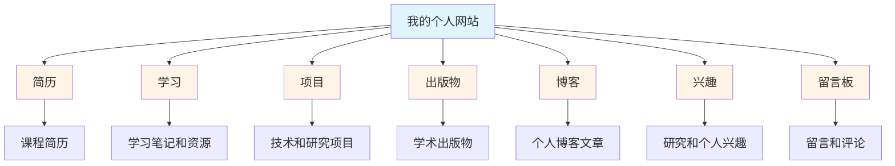

你好，我是<strong>李安然（Anthony Li）</strong> 🎉

作为上海财经大学数据科学专业的本科生，我对<strong>人工智能</strong>和<strong>多智能体系统</strong>充满热情，探索这些技术如何解决现实世界的问题。作为 INTJ，我喜欢深入复杂问题并找到创新的解决方案。

目前积极学习和研究基于 LLM 的智能体框架及其应用，同时在线学习吴恩达教授的 CS229 机器学习课程。

<h2>网站概览</h2>

  
📄 简历

  
我的简历和专业背景，提供关于我的教育、技能和经验的全面概述。

  
📖 学习

  
我的学习笔记和资源，包括课程材料、研究总结和教程编写。这是我记录学习历程和分享有用资源的地方。

  
📁 项目

  
我的技术和研究项目集合，展示我在数据科学、AI 和多智能体系统方面的实际工作。每个项目包括详细描述、技术栈和代码仓库链接。

  
📚 出版物

  
我的学术出版物和研究工作，涵盖数据科学和人工智能领域。

  
📰 博客

  
个人博客文章，我在这里分享关于我的工作、学习和 AI 技术兴趣的想法、更新和反思。

  
🎯 兴趣

  
我的研究和个人兴趣，包括在大语言模型、AI 智能体、数据科学方面的工作，以及音乐、游戏、游泳和桌游等爱好。

  
📧 留言板

  
访客可以留言、评论或提问的空间。欢迎在这里与我联系！

---

<em>本网站由 Jekyll 和 Academic Pages 构建。欢迎探索和联系！</em>
