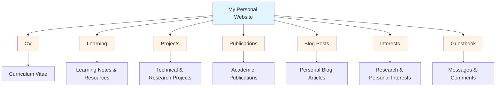

Anran Li (Anthony Li)</strong>" data-lang-zh="你好，我是<strong>李安然（Anthony Li）</strong>">Hello, I'm <strong>Anran Li (Anthony Li)</strong> 🎉

Artificial Intelligence</strong> and <strong>Multi-Agent Systems</strong>, exploring how these technologies can solve real-world problems. Being an INTJ, I enjoy diving deep into complex problems and finding innovative solutions." data-lang-zh="作为上海财经大学数据科学专业的本科生，我对<strong>人工智能</strong>和<strong>多智能体系统</strong>充满热情，探索这些技术如何解决现实世界的问题。作为 INTJ，我喜欢深入复杂问题并找到创新的解决方案。">As an undergraduate student majoring in Data Science at Shanghai University of Finance and Economics, I'm passionate about <strong>Artificial Intelligence</strong> and <strong>Multi-Agent Systems</strong>, exploring how these technologies can solve real-world problems. Being an INTJ, I enjoy diving deep into complex problems and finding innovative solutions.

Currently actively learning and researching in the field of LLM-based agent frameworks and their applications, while taking Professor Andrew Ng's CS229 course on Machine Learning online.

<h2 data-lang data-lang-en="Website Overview" data-lang-zh="网站概览">Website Overview</h2>

  
📄 CV

  
My curriculum vitae and professional background, providing a comprehensive overview of my education, skills, and experiences.

  
📖 Learning

  
Notes and resources from my studies, including course materials, research summaries, and tutorial write-ups. A place where I document my learning journey and share useful resources.

  
📁 Projects

  
A collection of my technical and research projects, showcasing my practical work in data science, AI, and multi-agent systems. Each project includes detailed descriptions, technology stack, and links to code repositories.

  
📚 Publications

  
My academic publications and research work in field of data science and artificial intelligence.

  
📰 Blog Posts

  
Personal blog articles where I share my thoughts, updates, and reflections on my work, studies, and interests in AI and technology.

  
🎯 Interests

  
My research and personal interests, including work in Large Language Models, AI Agents, Data Science, as well as hobbies like music, gaming, swimming, and board games.

  
📧 Guestbook

  
A space for visitors to leave messages, comments, or questions. Feel free to connect with me here!

---

This website is built with Jekyll & Academic Pages. Feel free to explore and connect!</em>" data-lang-zh="<em>本网站由 Jekyll 和 Academic Pages 构建。欢迎探索和联系！</em>"><em>This website is built with Jekyll & Academic Pages. Feel free to explore and connect!</em>
