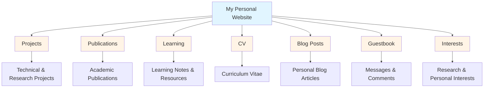

Hello, I'm **Anran Li (Anthony Li)** 🎉

As an undergraduate student majoring in Data Science at Shanghai University of Finance and Economics, I'm passionate about **Artificial Intelligence** and **Multi-Agent Systems**, exploring how these technologies can solve real-world problems. Being an INTJ, I enjoy diving deep into complex problems and finding innovative solutions.

Currently, I'm actively learning and researching in the field of LLM-based agent frameworks and their applications. I'm taking Professor Andrew Ng's CS229 course on Machine Learning online, and studying fundamental knowledge about Large Language Model architectures to build a solid foundation for my future research work.

## Website Overview

  
📁 Projects

  A collection of my technical and research projects, showcasing my practical work in data science, AI, and multi-agent systems. Each project includes detailed descriptions, technology stack, and links to code repositories.

  
📚 Publications

  My academic publications and research work in the field of data science and artificial intelligence. 

  
📖 Learning

  Notes and resources from my studies, including course materials, research summaries, and tutorial write-ups. A place where I document my learning journey and share useful resources.

  
📄 CV

  My curriculum vitae and professional background, providing a comprehensive overview of my education, skills, and experiences.

  
📰 Blog Posts

  Personal blog articles where I share my thoughts, updates, and reflections on my work, studies, and interests in AI and technology.

  
📧 Guestbook

  A space for visitors to leave messages, comments, or questions. Feel free to connect with me here!

  
🎯 Interests

  My research and personal interests, including work in Large Language Models, AI Agents, Data Science, as well as hobbies like music, gaming, swimming, and board games.

---

*This website is built with Jekyll & Academic Pages. Feel free to explore and connect!*