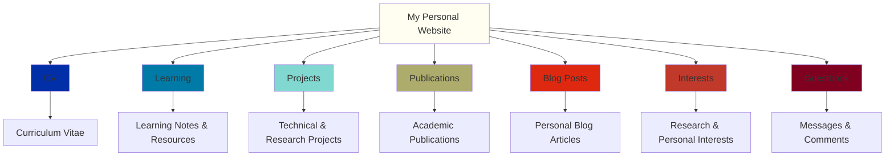

Hello, I'm <strong>Anran Li (Anthony Li)</strong> 🎉

As an undergraduate student majoring in Data Science at Shanghai University of Finance and Economics, I'm passionate about <strong>Artificial Intelligence</strong> and <strong>Multi-Agent Systems</strong>, exploring how these technologies can solve real-world problems. Being an INTJ, I enjoy diving deep into complex problems and finding innovative solutions.

Currently actively learning and researching in the field of LLM-based agent frameworks and their applications, while taking Professor Andrew Ng's CS229 course on Machine Learning online to build a solid foundation for future research work.

<h2 data-i18n="pages.about.overview">Website Overview</h2>

  
📄 CV

  My curriculum vitae and professional background, providing a comprehensive overview of my education, skills, and experiences.

  
📉 Learning

  Notes and resources from my studies, including course materials, research summaries, and tutorial write-ups. A place where I document my learning journey and share useful resources.

  
📧 Projects

  A collection of my technical and research projects, showcasing my practical work in data science, AI, and multi-agent systems. Each project includes detailed descriptions, technology stack, and links to code repositories.

  
📎 Publications

  My academic publications and research work in field of data science and artificial intelligence.

  
📪 Blog Posts

  Personal blog articles where I share my thoughts, updates, and reflections on my work, studies, and interests in AI and technology.

  
🎆 Interests

  My research and personal interests, including work in Large Language Models, AI Agents, Data Science, as well as hobbies like music, gaming, swimming, and board games.

  
📟 Guestbook

  A space for visitors to leave messages, comments, or questions. Feel free to connect with me here!

---

<em data-i18n="pages.about.footer">This website is built with Jekyll & Academic Pages. Feel free to explore and connect!</em>
